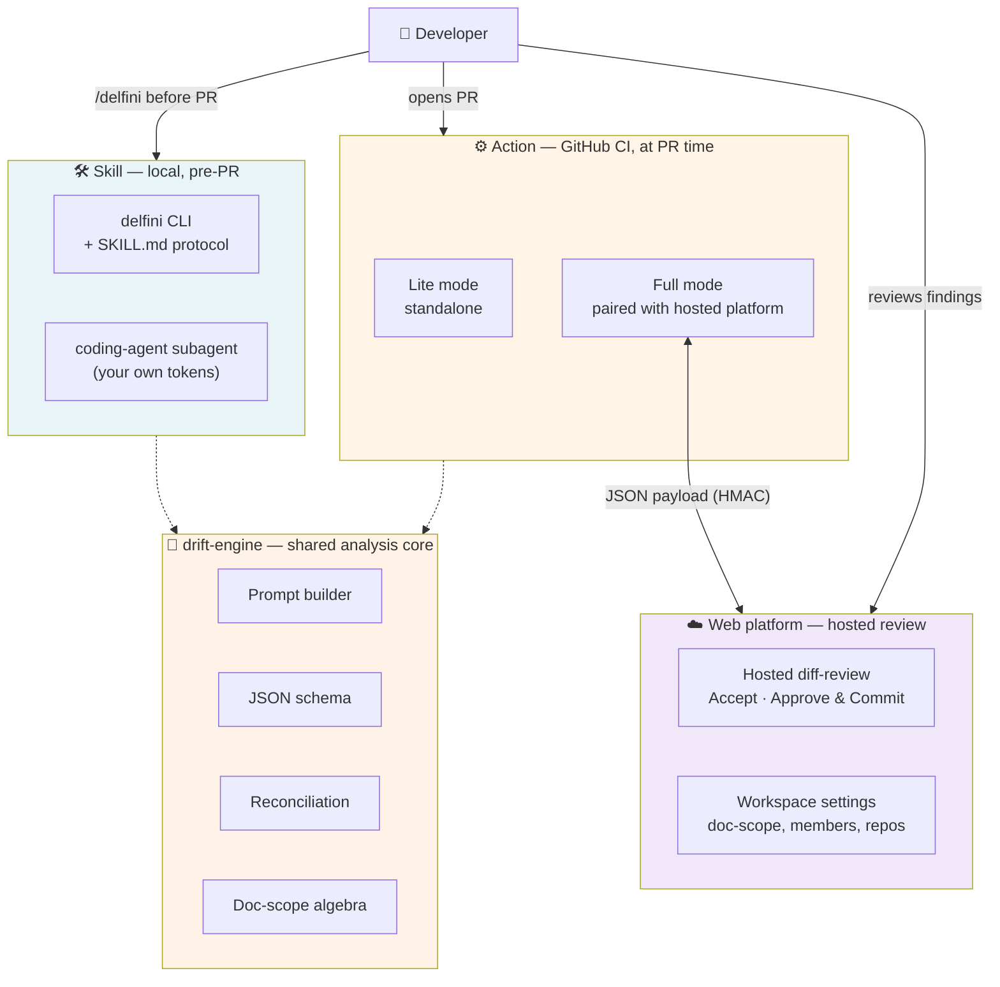

# Delfini

[](https://www.npmjs.com/package/@delfini/cli)
[](https://www.npmjs.com/package/@delfini/drift-engine)
[](https://www.npmjs.com/package/@delfini/action-core)
[](./LICENSE)

**Delfini detects when a code change has made your documentation wrong — and proposes the one-click fix.**

When a pull request's diff contradicts something the docs claim, Delfini flags it and hands you a concrete edit: the exact file, the exact lines, and the replacement text. A developer or reviewer approves it, and the doc fix lands on the same branch as the code change.

It runs as **three independent components**, each meeting you where you already work — your editor, your CI, and (optionally) a hosted review surface. They all share one analysis engine, so a problem caught locally is identical to what CI would have caught. This repository is the open-source core (Apache-2.0): the **Skill**, the standalone **Action**, and the shared **engine**.

---

## Why documentation drift is worth solving

Code is enforced by compilers, tests, and reviewers. **Documentation isn't.** So when code changes, the related docs usually fall into one of three bad outcomes: updated in a follow-up PR (a gap of hours or days), updated in an issue someone may never close, or **silently wrong forever**. Docs are written once and read thousands of times — a single stale sentence misleads at scale, and it's invisible to the author (who knows what they meant) and to readers (who assume the page is current).

The tools teams reach for don't close this gap: manual review doesn't have time to re-read every touched doc; lint rules catch broken links, not broken *claims*; snapshot tests detect that text changed, not whether it became wrong.

Delfini's bet is simple: **a language model is good at the one job humans are bad at** — re-reading every section of every touched doc against a fresh diff, every single time, without getting bored. Given a diff and the docs you've chosen to track, it produces structured findings of three kinds:

- **drift** — "this diff contradicts an existing claim; replace these lines with this text"
- **additive** — "this diff introduces a concept the docs don't cover; insert this content here"
- **clarification** — "I'm not sure this is drift; a human should look at this section" (never auto-applied)

Delfini is a focused drift detector — not a general docs assistant. It doesn't write docs from scratch, summarize your codebase, or answer freeform questions. One input (a diff), one output (drift findings on the docs you track).

---

## The three components

| Component | Where it runs | When | Who pays for the LLM |
|---|---|---|---|
| **Skill** | Inside your coding agent (Claude Code), on your machine | Before you open the PR | Your existing coding-agent tokens — **zero new cost** |
| **Action** | GitHub CI, on every push | At PR time | Your own LLM API key (Anthropic or OpenAI) |
| **Web platform** | Hosted SaaS | After the Action runs | Workspace subscription (the upgraded reviewer experience) |

A doc fix is cheapest when it lands closest to you: the **Skill** fixes drift in your working tree *before the PR exists* (no CI minutes, no public record of shipped-broken-docs); the **Action** catches it at PR time with a structured suggestion on the diff; the hosted **Web platform** adds a one-click "Approve & Commit" review surface. Most teams use one or two of the three — they're fully independent.



**One engine, identical results.** Every component imports the same `@delfini/drift-engine` package — the prompt, schema, and reconciliation logic live in exactly one place, guarded by automated parity tests. A finding the Skill surfaces locally is the same finding the Action would surface on the eventual PR. They cannot drift apart by accident.

---

## Quick start

### The Skill — local drift detection in your editor

The lightest way to try Delfini. No account, no API key, no GitHub App — it runs inside your existing coding agent and uses your existing tokens.

```bash
npx @delfini/cli install .
```

That scaffolds `.claude/skills/delfini/SKILL.md` into your repo and asks one question — *"Auto-invoke `/delfini` when you open a PR?"*. From then on, `/delfini` in Claude Code analyzes your working tree against your docs and offers to apply the fixes:

```
Apply all (a) / Pick subset (s) / Skip (n)?
```

The CLI is deterministic and **never calls an LLM itself** — your coding agent does the analysis with its own tokens, which is exactly why the Skill costs your team nothing new. Full reference: [`packages/cli/README.md`](./packages/cli/README.md).

### The Action — drift detection in CI

The Action runs on every PR push and posts its findings back to GitHub. Consume it as a monorepo-subdirectory reference, pinned to a release tag:

```yaml
- name: Run Delfini
  uses: Legends-of-Tech/delfini/apps/action@v0
  env:
    GITHUB_TOKEN: ${{ secrets.GITHUB_TOKEN }}
    LLM_API_KEY: ${{ secrets.LLM_API_KEY }}
    LLM_PROVIDER: anthropic
  with:
    doc_scope: |
      docs
      README.md
      docs/adr/**/*.md
    enforcement: warning
```

On each push it reads your diff and the docs matched by `doc_scope`, runs the analysis, posts a single rich PR comment (target file, line range, proposed replacement, severity, evidence), and sets the check green (no drift) or yellow (drift found). `doc_scope` takes a newline- or comma-delimited list of directories, files, or globs and defaults to `docs/`. Full input/env reference: [`apps/action/README.md`](./apps/action/README.md).

**This open-source Action is standalone by design.** It reads your repo, calls your own LLM key, and posts a comment — it makes no calls to any hosted service. If a Delfini workspace token is supplied it **hard-fails with a clear error** rather than silently behaving differently; pairing with the hosted review platform ("Full mode") is a separate product. See the Delfini platform documentation for that.

> A monorepo-subdirectory action can't be listed on the GitHub Marketplace, so pin to a release tag via the `uses:` reference above rather than searching the Marketplace.

---

## What this means for evaluators

**What leaves your machine.** Delfini never proxies LLM calls — your diff and docs go directly from your machine (or CI runner) to your LLM provider under your own agreement, never through Delfini infrastructure. The Skill sends nothing to any Delfini service. The Action, even when paired with the hosted platform, sends only the *structured findings* (file, line range, proposed text, severity) to that platform — never the raw diff or doc contents.

**What it costs.** A typical feature PR runs in the low single-digit cents; a doc-heavy refactor lands around ~15¢. Default-on relevance retrieval keeps the prompt focused — it scores each doc section against the diff and drops the irrelevant ones, typically cutting prompt size ~40% with no measurable recall loss. There's a hard prompt-size budget so a runaway diff fails fast rather than running up a bill.

**How it stays honest.** The language model is fast but sloppy with line numbers, so the engine line-numbers every doc before analysis and then verifies the quoted text actually matches the doc at the cited lines — hallucinated findings are discarded before they reach you.

---

## What's in this repository

This is the open-source Delfini monorepo. It contains three published npm packages plus the standalone Action:

| Package | What it is | Distribution |
|---|---|---|
| [`packages/drift-engine`](./packages/drift-engine) | The pure-logic analysis core — prompt assembly, schema, reconciliation, doc-scope matching. No I/O, no LLM client. | npm: [`@delfini/drift-engine`](https://www.npmjs.com/package/@delfini/drift-engine) |
| [`packages/cli`](./packages/cli) | The **Skill** CLI — local drift detection inside your coding agent. Deterministic; never calls an LLM itself. | npm: [`@delfini/cli`](https://www.npmjs.com/package/@delfini/cli) |
| [`packages/action-core`](./packages/action-core) | The shared pipeline core of the Delfini GitHub Action (doc reading, change classification, analysis assembly, orchestration). | npm: [`@delfini/action-core`](https://www.npmjs.com/package/@delfini/action-core) |
| [`apps/action`](./apps/action) | The standalone **Action** — analyzes a PR in CI with your own LLM key and posts a structured-findings comment. | GitHub Action (subdirectory `uses:` reference). Not published to npm. |

All three npm packages ship from this repo with provenance attestation via [changesets](./.changeset/README.md).

```
apps/action/            The standalone GitHub Action (ncc-bundled; dist/ committed at the ref)
packages/drift-engine/  Pure-logic analysis core (npm: @delfini/drift-engine)
packages/action-core/   Shared Action pipeline core (npm: @delfini/action-core)
packages/cli/           The Skill CLI (npm: @delfini/cli; bundles drift-engine)
.changeset/             Release machinery (changesets)
.claude/skills/delfini/ The product Skill artefact (what `delfini install` scaffolds)
```

---

## Development

Requirements: Node.js 20+, [pnpm](https://pnpm.io/) 10+.

```bash
pnpm install

# Build (order matters: drift-engine → action-core → cli → action)
pnpm --filter @delfini/drift-engine build
pnpm --filter @delfini/action-core build
pnpm --filter @delfini/cli build
pnpm --filter @delfini/action build

# Verify
pnpm typecheck
pnpm lint
pnpm test
```

The Skill and the Action share `@delfini/drift-engine`, and automated parity tests on every PR keep their analysis byte-identical — so the engine's behavior can't fork between the two surfaces. Releases are automated with changesets; see [`.changeset/README.md`](./.changeset/README.md) and [`CONTRIBUTING.md`](./CONTRIBUTING.md).

## License

[Apache-2.0](./LICENSE)
